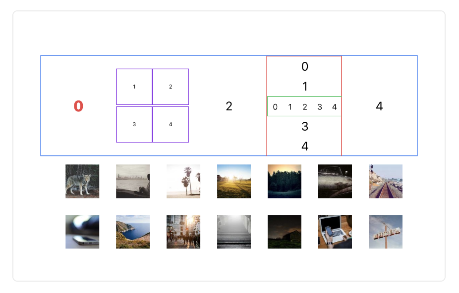
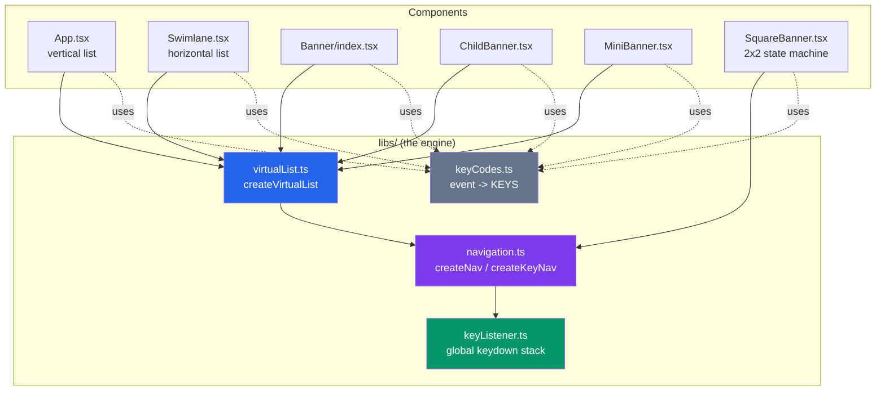
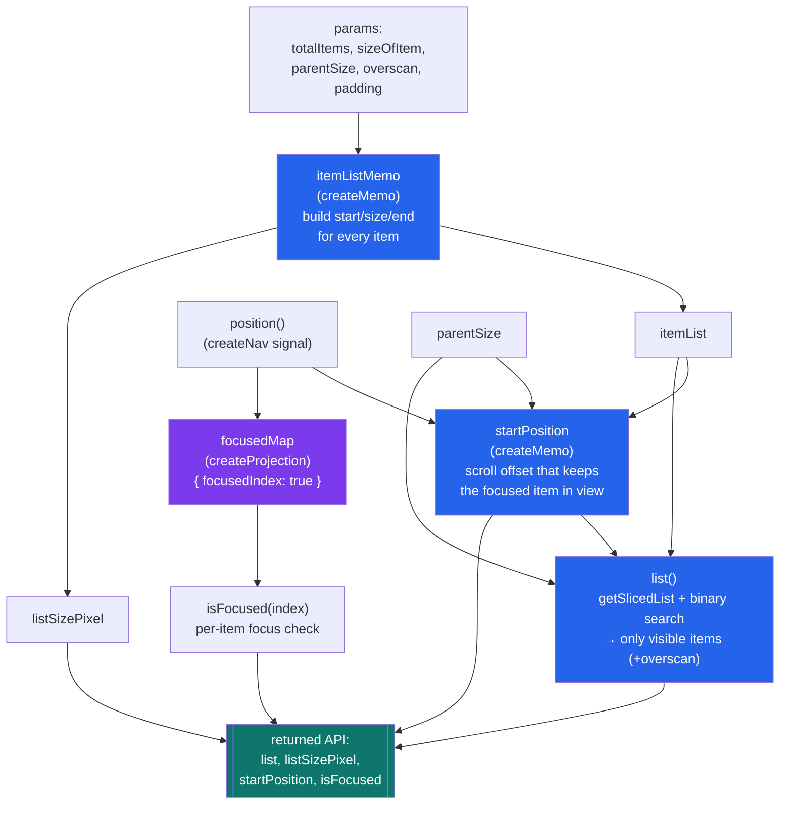
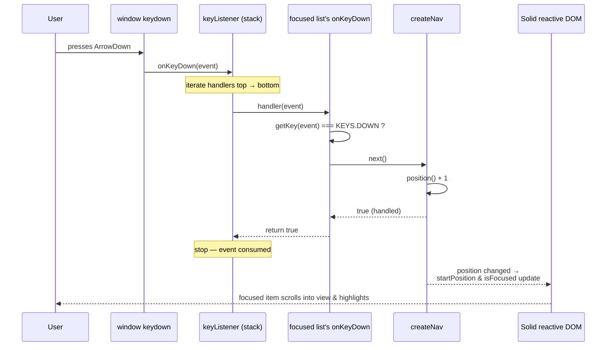
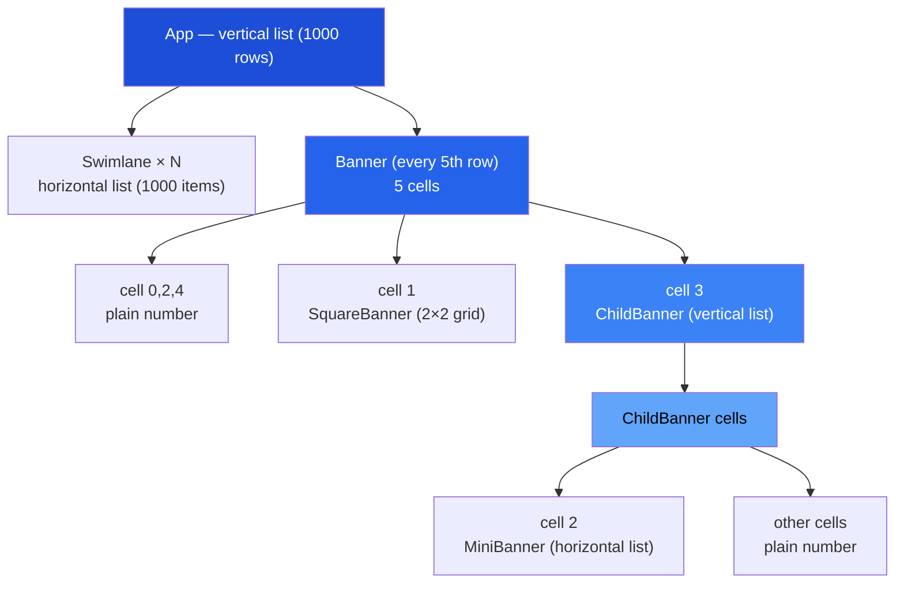
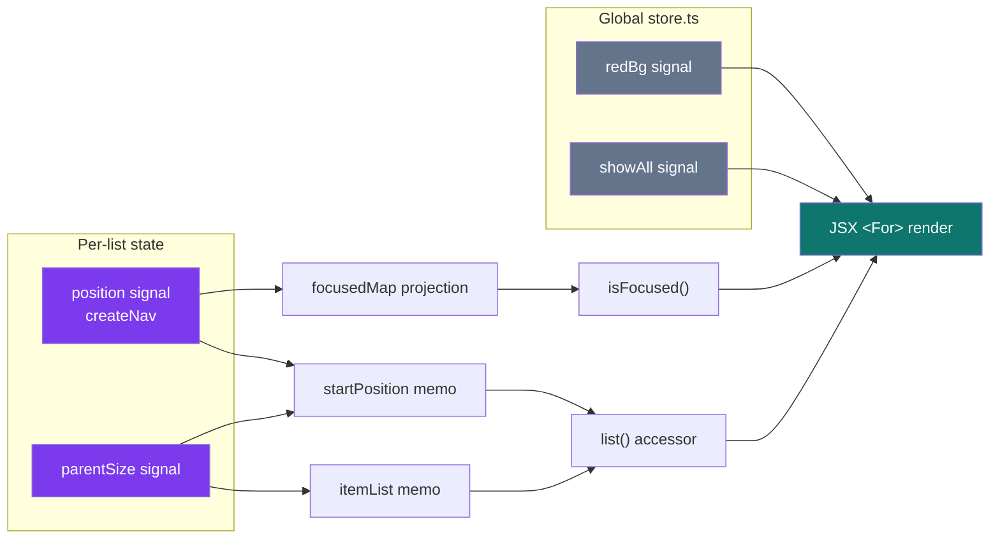

# solid-vlist

A **virtual (windowed) list** built with [SolidJS](https://www.solidjs.com/), designed for
**spatial keyboard / D-pad navigation** — the kind of UI you find on a TV or set-top box.

It renders a vertical list of **1000 rows**, where every row is itself a nested, independently
navigable virtual list. Only the items currently visible in the viewport are rendered to the DOM,
so the list stays fast regardless of how many items it logically contains.

> Built on Solid **2.x**, Vite, and Tailwind CSS v4.

## Output



---

## What makes it interesting

- **Virtualization** — thousands of items, but only the visible window (plus a small overscan) is in the DOM.
- **Spatial navigation** — arrow keys, `hjkl` (vim), and Android TV D-pad codes all move a focus cursor.
- **Arbitrary nesting** — a list item can contain another virtual list, which can contain another, and so on.
- **Focus isolation** — only the currently focused list responds to key presses, via a stacked global key dispatcher.
- **Fine-grained reactivity** — moving focus only updates the two items whose highlight changes, not the whole list.

### Controls

| Key(s)                          | Action                                  |
| ------------------------------- | --------------------------------------- |
| `↑` `↓` / `K` `J`               | Move focus up / down (vertical lists)   |
| `←` `→` / `H` `L`               | Move focus left / right (swimlanes)     |
| `Enter` / `Space`               | Select (reserved)                       |
| `M`                             | Toggle red background on labels         |
| `A`                             | Toggle "show all labels" vs focused-only |

D-pad key codes (`KEYCODE_DPAD_*`) are also mapped for TV remotes.

---

## Project structure

```
src/
├── index.tsx               # App entry — mounts <App> into #root
├── App.tsx                 # Root vertical virtual list (1000 rows)
├── store.ts                # Global UI signals (redBg, showAll)
├── index.css               # Tailwind import
│
├── components/
│   ├── Swimlane.tsx        # A horizontal virtual list of 1000 items
│   └── Banner/
│       ├── index.tsx       # A 5-cell banner row (every 5th App row)
│       ├── ChildBanner.tsx # Nested vertical list inside a banner cell
│       ├── MiniBanner.tsx  # Nested horizontal list inside a child banner
│       └── SquareBanner.tsx# A 2×2 grid driven by a focus state machine
│
└── libs/
    ├── virtualList.ts      # createVirtualList — the windowing engine
    ├── navigation.ts       # createNav (cursor) + createKeyNav (focus-scoped key binding)
    ├── keyListener.ts      # Global stacked keydown dispatcher
    └── keyCodes.ts         # Maps raw key events → logical KEYS enum
```

---

## Architecture overview

The three `libs/` modules form a layered engine. Components sit on top and only ever call
`createVirtualList` (or `createKeyNav` for the special SquareBanner).



**Responsibilities, bottom to top:**

| Layer                 | File              | Responsibility                                                                 |
| --------------------- | ----------------- | ------------------------------------------------------------------------------ |
| Key mapping           | `keyCodes.ts`     | Translate a raw `KeyboardEvent` into a logical `KEYS` value.                    |
| Global dispatch       | `keyListener.ts`  | One `keydown` listener; keeps a stack of handlers, dispatches top-first.        |
| Cursor + binding      | `navigation.ts`   | `createNav` holds the moving index; `createKeyNav` subscribes while focused.    |
| Windowing engine      | `virtualList.ts`  | Measure items, compute the visible window, scroll-into-view, keyed focus map.   |
| Presentation          | components        | Render the visible slice; delegate movement & focus to the engine.             |

---

## The windowing engine (`createVirtualList`)

Given the total item count, a per-item size function, and the parent's measured size,
`createVirtualList` returns reactive accessors describing *what to render* and *where*.



**Returned API**

| Accessor             | Type                        | Meaning                                                     |
| -------------------- | --------------------------- | ----------------------------------------------------------- |
| `list()`             | `Accessor<ListItem[]>`      | Only the items in the current viewport window (+ overscan). |
| `listSizePixel()`    | `Accessor<number>`          | Total scrollable size in px (used to size the track).       |
| `startPosition()`    | `Accessor<number>`          | Pixel offset to translate the track so focus stays visible. |
| `focusedIndex()`     | `Accessor<number>`          | The current cursor index.                                   |
| `isFocused(index)`   | `(index) => boolean`        | Whether a given index is focused (fine-grained).            |

Key implementation details:

- **Binary search slicing** — `getSlicedList` finds the window boundaries with a `lowerBound`
  binary search over the (sorted) item list, so each render is `O(log n)` rather than `O(n)`.
- **Reactive measurement** — the item list is a `createMemo`, so when `parentSize` is measured
  (via `onSettled`) and `sizeOfItem` depends on it, the list recomputes correctly.
- **Keyed focus** — `isFocused` reads from a `createProjection` map keyed by index. Moving the
  cursor only notifies the two indices whose focus state flips, avoiding a re-run on every row.

---

## How a key press flows through the system

Every list that is *focused* subscribes its handler to the global key stack. Because the stack is
dispatched **top-first and stops at the first handler that returns `true`**, only the deepest
focused list consumes the event — this is what gives nested lists their natural focus containment.



**Focus subscription lifecycle** (`createKeyNav`): a Solid effect watches the component's
`focused` accessor. While focused, it subscribes the handler to the key stack and returns the
unsubscribe function as cleanup — so losing focus (or unmounting) automatically detaches it.

---

## The nested layout

The root `App` is a vertical virtual list. Every 5th row is a `Banner`; the rest are `Swimlane`s.
Banners nest further, demonstrating that the engine composes to any depth.



`SquareBanner` is the one component that does **not** use `createVirtualList` — it is a small,
fixed 2×2 grid whose focus moves via an explicit `stateMachine` lookup table (`1↔2`, `1↔3`, etc.),
wired directly to `createKeyNav`.

---

## Reactive data flow (Solid signals)



- `store.ts` holds two **global** signals (`redBg`, `showAll`) toggled by the `M` and `A` keys and
  read by every rendered label.
- Each list instance owns a **local** `position` (cursor) and `parentSize` (measured on mount).
- Everything downstream (`startPosition`, `list`, `isFocused`) is derived, so the DOM updates
  automatically and minimally when any source changes.

---

## Tech stack

| Concern        | Choice                                     |
| -------------- | ------------------------------------------ |
| UI framework   | SolidJS 2.x (`solid-js` + `@solidjs/web`)  |
| Build tool     | Vite                                       |
| Styling        | Tailwind CSS v4 (`@tailwindcss/vite`)      |
| Legacy support | `@vitejs/plugin-legacy` (minified via terser) |
| Language       | TypeScript                                 |

---

## Available scripts

### `npm run dev` / `npm start`

Runs the app in development mode, served on `0.0.0.0`. Open the URL printed in the terminal
(watch the output for the exact port). The page hot-reloads on edits.

### `npm run build`

Builds the production bundle into `dist/` — a modern bundle plus a legacy bundle (for older
browsers / TV webviews), both minified with terser and content-hashed.

### `npm run serve`

Previews the production build locally.

---

## Deployment

The `dist/` folder is static and can be hosted on any static provider (Netlify, Vercel, GitHub
Pages, S3, etc.).
